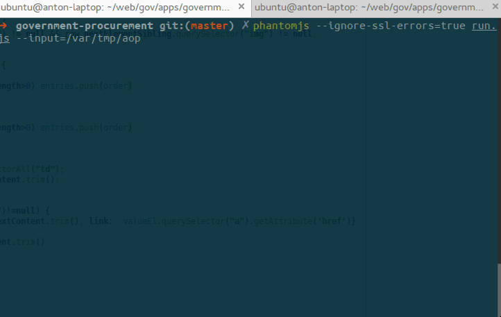

# Извличане на спечелени обществени поръчжи по име на бизнес
## Извличане на данни от aop.bg

### Изисквания
 - `nodes`  (тествано с `0.10.13`)
 - `phantomjs`  (тествано с `1.9.2`)

За инсталацията на точна, лесно сменима версия на `nodejs` е удобно да се ползва [nvm](https://github.com/creationix/nvm).

Щом има вече работещ `nodejs` , то `phantomjs`  се инсталира лесно: `npm install phantomjs --global`

### Инсталация
След като имате горните изисквания, влезте в директорията на `government-procurement` и изпълнете:

```
npm install
```

Това ще се погрижи, за да са на лице всички нужни модули.

### Употреба

```
mkfifo /var/tmp/aop
phantomjs --ignore-ssl-errors=true run.js --input=/var/tmp/aop
```
Сега процесът ще чака за имена на фирми подадени към `/var/tmp/aop`. Най-често ще има друг процес, който да пълни `/var/tmp/aop` с имената; едно име на всеки ред.

За да сработи примера можем в друг "терминал" да напишем:

```
echo "Име на фирма ЕООД" > /var/tmp/aop
```

### Примерен резултат
На фирма, която е спечелила 2 обществени порчъки:

```
[
    {
        "Водещ документ:":{
            "link":"case2.php?mode=show_doc&doc_id=XXXXX&newver=X",
            "text":"Решение (XXXXX)"
        },
        "Възложител:":"Община XXXXX",
        "Име:":"",
        "Описание:":"Упражняване XXXXXXXXXXX",
        "Получен на:":"XXX.10.2013 г.",
        "Преписка:":{
            "link":"case2.php?mode=show_case&case_id=XXXXXX",
            "text":"00012-2013-XXX (Възложена)"
        },
        "Процедура:":"Договаряне без обявление по ЗОП"
    },
    {
        "Водещ документ:":{
            "link":"case2.php?mode=show_doc&doc_id=YYYYYY&newver=Y",
            "text":"Решение (YYYYYY)"
        },
        "Възложител:":"Община YYYYYY",
        "Заключение от предварителен контрол:":{
            "link":"jc_view.php?id=YYYYYY",
            "text":"Становище за осъществен предварителен контрол по чл. YYYYYY. ал. YYYYYY, т. YYYYYY от ЗОП"
        },
        "Име:":"",
        "Описание:":"„Упражняване на YYYYYYYYYYYY",
        "Получен на:":"YYY.08.2012 г.",
        "Преписка:":{
            "link":"case2.php?mode=show_case&case_id=YYYYYY",
            "text":"00115-2012-YYYYYY (Възложена)"
        },
        "Процедура:":"Договаряне без обявление по ЗОП"
    }
]
```

### Demo


### Технологични решения

#### Зашо чист phantomjs, а не нещо друго?

Погледнати бяха:

 - [selenium-webdriver](https://code.google.com/p/selenium/wiki/WebDriverJs), виж след списъка за забележки по webdriver
 - [admc/wd](https://github.com/admc/wd), виж след списъка за забележки по webdriver
 - [WaterfallEngineering/selenium-node-webdriver](https://github.com/WaterfallEngineering/selenium-node-webdriver), виж след списъка за забележки по webdriver
 - [n1k0/casperjs](https://github.com/n1k0/casperjs) - има същия проблем като чисто phantomjs, че не може да ползва nodejs модули. тоест фактически просто е 1 допълнителен слой, който увеличава възможността за бъгове
 - [WaterfallEngineering/SpookyJS](https://github.com/WaterfallEngineering/SpookyJS) - прекалено много абстакция, от phantomjs до casperjs и вече отделно до nodejs.
 - [sheebz/phantom-proxy](https://github.com/sheebz/phantom-proxy), wrapper, тоест няма винаги да е актуален с phantomjs, също превръща всяко повикване към phantomjs в async, което е лудост да се поддръжа
 - [sgentle/phantomjs-node](https://github.com/sgentle/phantomjs-node), wrapper, тоест няма винаги да е актуален с phantomjs, също превръща всяко повикване към phantomjs в async, което е лудост да се поддръжа
 - [alexscheelmeyer/node-phantom](https://github.com/alexscheelmeyer/node-phantom), wrapper, тоест няма винаги да е актуален с phantomjs, също превръща всяко повикване към phantomjs в async, което е лудост да се поддръжа

Тези библиотеки, които следват Webdriver протокола внасят:
 1. Поддръжка на phantomjs под формата на WebDriver сървър. Това 100% означава време в предотратяване на crashes.
 1. Нова API, вместо да може да се ползва js директно. Защо трябва да се учи нов API, ако може просто с JS?

Затова: **с чист phantomjs**.

#### Най-проблемното на phantomjs:

1. Не може да се види http отговора в суров вид.
1. Това, че може да се преглежда само DOM-а води до това че единствено могат да се свалят XML документи, нищо друго
1. Повикването на системни програми в Phantomjs е в много начален стадии. Не може да се подават данни към `stdin` на процеса
1. Това прави невъзможно да се кобинират:
  1. Процес който сваля файл по дадено URL
  1. Процес, чийто `stdin` поема съдържанието на изображение и според съдържанието извършва ..нещо.

#### Възможни решение за JAVA applet-и

 - http://www.froglogic.com/squish/gui-testing/
 - http://stackoverflow.com/questions/10765682/how-to-automate-java-applet
